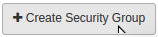
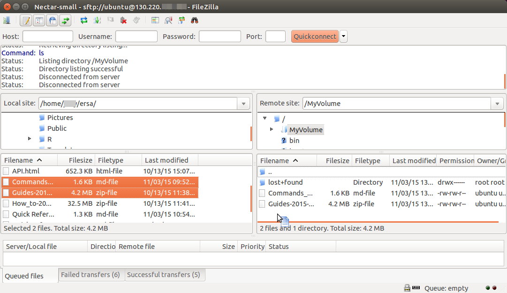

This tutorial will give a very quick overview of launchin and accessing a virtual machine (VM) in NeCTAR. These processes are covered in depth on the NeCTAR website Training Modules <http://training.nectar.org.au/> , and Support Pages <https://support.nectar.org.au/support/home>

This guide will show you how to **use** your NeCTAR VM to perform jobs, including tips on making efficient use of the high performance

## Launch a Virtual Machine (Instance)

1. Log on to the NeCTAR dashboard <https://dashboard.rc.nectar.org.au/project>
1. Select the correct project allocation in the top bar (if it starts with "pt- ", it is your default trial allocation)
1. Select "**Access & Security**" under the "Compute subheading in the left side main menu.
    1. Click "Create Security Group" 
    1. Name the security group 'SSH', with the description "port 22 for SSH". Click "Create Security Group"
    1. Click "**Manage Rules**" in the "Actions" drop-down menu. Click "**Add Rule**".
    1. Type "22" under "**Port**". Under "**CIDR**", you choose a range of IP adresses that can access your VM through port 22. If you keep it as "0.0.0.0/0", you can access your VM from any computer, but anyone else night find a way to access it also. Here are the IP ranges for SA University networks. Use one of these, and the VM can only be accessed form a University computer (including an external computer using a VPN to access the University network).
        - 129.127.0.0/16 - University of Adelaide
        - 129.96.0.0/16 - Flinders
        - 130.220.0.0/16 - UniSA 
    1. Select "**Key Pairs**" and use "**Import Key Pair**" to upload the public key of a keypair you have created in Putty (Windows users) or with `ssh-keygen -f ~/.ssh/keyname`. See <https://support.nectar.org.au/support/solutions/articles/6000055376-launching-virtual-machines> for instructions on setting up keypairs.
1. Select "**Instances**" in the left side main menu. Click "**Launch Instance**".
1. Give your VM a name, choose a "**Flavor**" (size of the VM), and select an Image (pre-loaded operating system, e.g. NeCTAR Ubuntu 14.04).
1. Select the "**Access & Security**" tab. Select your Key Pair name, and select the "**SSH**" security group.
1. If you are going to use a volume storage attachment, select the "**Availability Zone**" and choose "**sa**" from the drop-down menu.
1. Click "**Launch**". It may take a few minutes for the instance to boot.

## Connect to your VM

1. Copy the IP Address of the instance.
  - Windows - Set up a PuTTY connection with the IP address
  - Mac/Linux - In the terminal app, enter `ssh -i <keyname> ubuntu@<IPaddress>`
1. Many users like to use FileZilla to copy data between their computer and the VM, to visualise the file structure on the VM, and to edit text documents on the VM using a GUI application.
    1. Use the IP address to create a connection with the VM in FileZilla

## Downloading and Installing

- Try some commands to look around the VM
  - `ps` ; `df -hT` ; `top`
- Install "htop"
  - `apt-cache search htop`
  - `sudo apt-get install htop`
  - `htop`

- Run these commands periodically to update the package manager and the installed packages.
  - `sudo apt-get update`
  - `sudo apt-get upgrade`  

- To download "Structure", copy the URL for the latest release <http://pritchardlab.stanford.edu/structure_software/release_versions/>
  - Then use the "wget" command to download the tar.gz file. e.g.
    - `wget http://pritchardlab.stanford.edu/structure_software/release_versions/v2.3.4/release/structure_linux_console.tar.gz`

  - `tar -xvzf structure_linux_console.tar.gz`

  - `cd /mnt`
  - `wget https://github.com/joeygerlach/structure_parallel/archive/master.zip`
  - `sudo apt-get install unzip` 
  - `unzip master.zip`
  - `cd structure_parallel-master`

  - `bash Parallel_Structure.sh`
  
  - `htop`

<http://pritchardlab.stanford.edu/structure_software/release_versions/v2.3.4/release/structure_linux_console.tar.gz>
https://github.com/joeygerlach/structure_parallel/archive/master.zip

Launching and Connecting tutorials  
BASH tutorial  
FileZilla tutorial  
Parallel and NoHup guide
Quick commands table

appendix - 

FileZilla

## FileZilla  

FileZilla is one of many programs that provides easy, point-and-click SFTP (secure file transfer protocol).
Not only can you easily transfer files between your local computer and your virtual machine (VM),
but you can also open and edit documents that are on your VM, using programs on your local computer.

### Download and Install FileZilla

1. For Ubuntu - Install from the Ubuntu Software Centre app
1. Mac and Windows - Download the program file [FileZilla][filezilla]
1. Double click file - follow installation instructions for Windows
1. For Mac - drag the filezilla.app file to your Applications folder.
1. Open FileZilla

### SFTP connection to the VM

- Click the menu options  
 ***FileZilla OR Edit -> Settings OR Preferences -> Connection -> SFTP***

- Click ***Add key file*** and navigate to the folder storing your SSH keys. 

- *For Mac and Ubuntu:*

  1. *The keys are in '.ssh/' which will be hidden from view. There is a button in
  the window to allow you to type the address; enter '.ssh' in the input bar).*
  1. OR, *open your terminal and *enter the command `ln -s ~/.ssh ~/ssh` to create a symbolic 
  link called 'ssh' which will appear in file lists.*
  
- Choose your private key (choose the version with '.ppk' extension if available).
 FileZilla might ask to convert the fileformat. Click OK.
 

 
1. Open  ***File -> Site Manager*** . 
1. Click ***New Site*** and give it a name. 
1. Insert the *IP address* of the instance as ***Host***
1. ***Logon Type*** is interactive
1. The user is **'ubuntu'** (or 'host' if your VM has a different operating system)
1. Click ***Connect***

### FileZilla connection

The left side of the FileZilla window will list the files of your computer.  
The right side will contain the folders and files on the VM.

- Navigate to your data storage directory in the right side of the FileZilla screen.

- Drag and drop files and directories between your local computer and the VM.

- Right click in the file list area to:
    1. Create a directory or text file
    1. Edit a text document (you may need to adjust  
    ***FileZilla/Edit -> Settings/Preferences ->  File Editing*** to ensure documents open in your local computer's default text editor.
    1. Delete, download or rename files or directories, etc.

