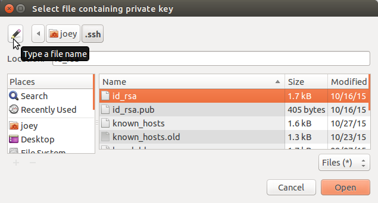
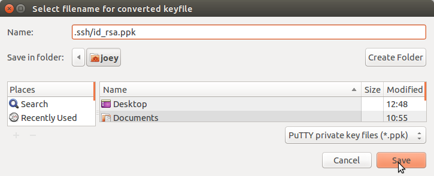
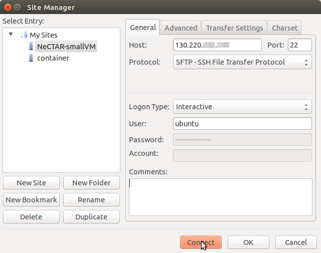
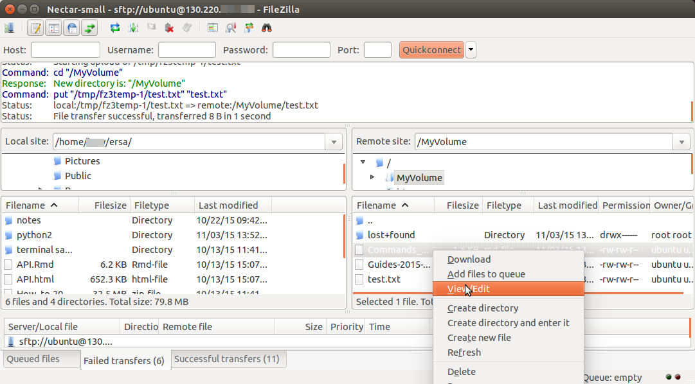
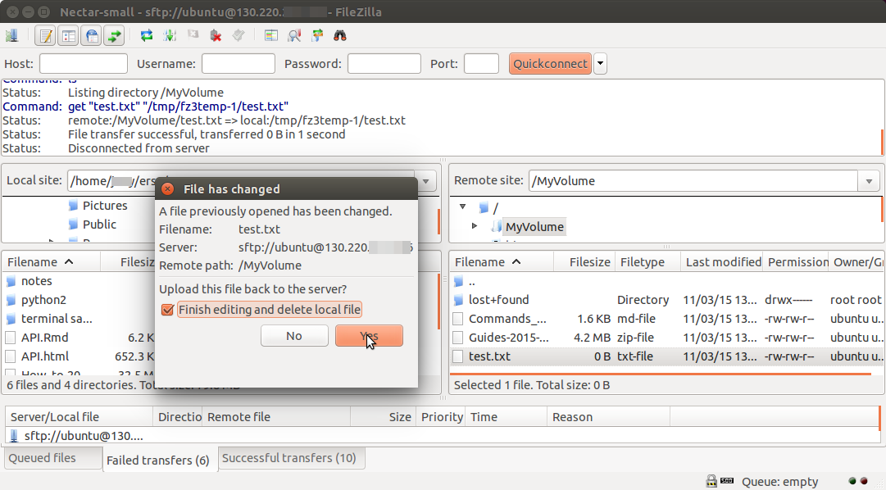

# Using the NeCTAR Cloud
Joey Gerlach  
5 January 2016  

## FileZilla 

FileZilla is one of many programs that provides easy, point-and-click SFTP (secure file transfer protocol).
Not only can you easily transfer files between your local computer and your virtual machine (VM),
but you can also open and edit documents that are on your VM, using programs on your local computer.

### Download and Install FileZilla

1. For Ubuntu - Install from the Ubuntu Software Centre app
1. Mac and Windows - Download the program file <https://filezilla-project.org/download.php?type=client>
1. Double click file - follow installation instructions for Windows
1. For Mac - drag the filezilla.app file to your Applications folder.
1. Open FileZilla

## Add SSH keyfile

- Click the menu options  
 ***FileZilla OR Edit -> Settings OR Preferences -> Connection -> SFTP***

- Click ***Add key file*** and navigate to the folder storing your SSH keys. 

    - *For Mac and Ubuntu:*  
    The keys are in '~/.ssh/' which will be hidden from view. There is a button in the window to allow you to type the address; enter '**.ssh**' in the input bar).*
    
  
- Choose your private key.  
 FileZilla might ask to convert the fileformat. Click OK.

---

---
 

---

## Connecting FileZilla to the VM
 
1. Open  ***File -> Site Manager*** . 
1. Click ***New Site*** and give it a name. 
1. Insert the *IP address* of the instance as ***Host***
1. ***Logon Type*** is interactive
1. The user is **'ubuntu'** (or 'host' if your VM has a different operating system)
1. Click ***Connect***

---

## FileZilla connection

The left side of the FileZilla window will list the files of your computer.  
The right side will contain the folders and files on the VM.

- Navigate to your data storage directory in the right side of the FileZilla screen.
- Drag and drop files and directories between your local computer and the VM.
- Right click in the file list area to:
    1. Create a directory or text file
    1. Edit a text document (you may need to adjust  
    ***FileZilla/Edit -> Settings/Preferences ->  File Editing*** to ensure documents open in your local computer's default text editor.
    1. Delete, download or rename files or directories, etc.

---

---

